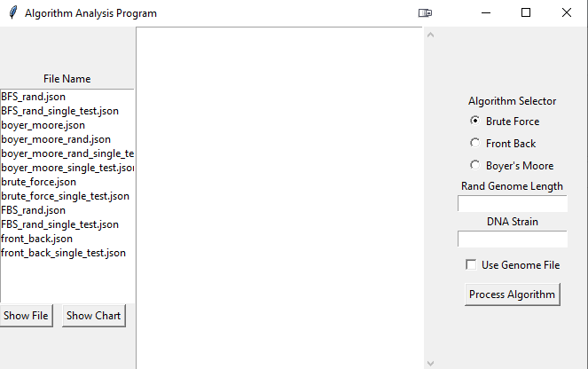
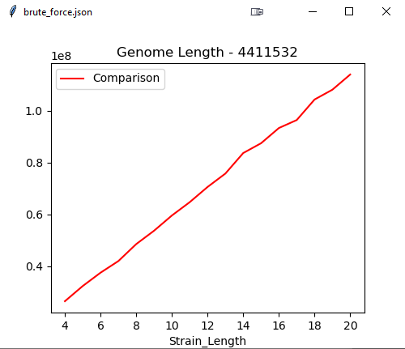
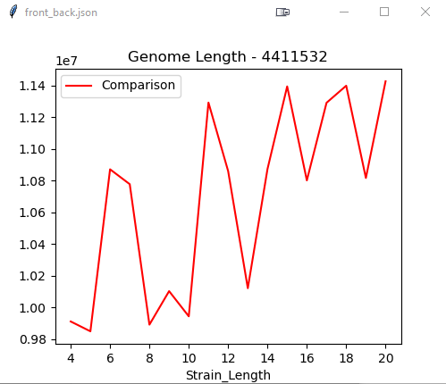
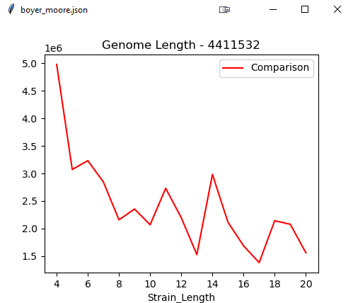

# SearchStringAlogrithm  
This project is only for a school lab assignment, the implementation is rather quick and dirty especially the GUI.
 
The implementation of the genome files and output files are manually hardcoded. 
 
## Run app_gui.py 

## Algorithm Run Time Analysis Charts
The algorithms below are run on a genome string file with 4411532 length.

Brute Force             |  Front Back
:-------------------------:|:-------------------------:
 | 

Front Back             |  Boyer's Moore
:-------------------------:|:-------------------------:
 | 

# Files Description

## fileReadWriteParse.py
> configures the json file input and output by changing the file_name variable to another json file
## app_gui.py
> Shows DNA Strain Length vs Comparison Chart
## algorithm_playground.py
> Processes the Genome and Dna Strain Search, saves to a json output file

## algorithm files

> boyer_moore.py

> front_back.py

> brute_force.py

## output files

> ./output_files

## genome files

> ./genome_files
